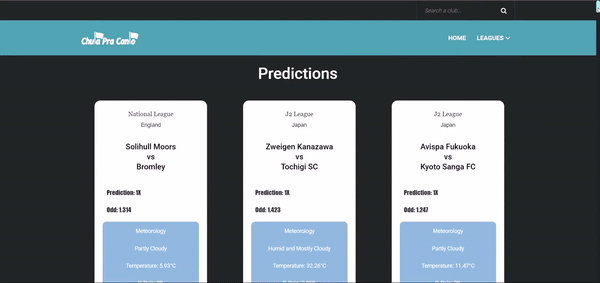

[![Contributors][contributors-shield]][contributors-url]
[![Forks][forks-shield]][forks-url]
[![Stargazers][stars-shield]][stars-url]
[![Issues][issues-shield]][issues-url]
[![MIT License][license-shield]][license-url]
[![LinkedIn][linkedin-shield]][linkedin-url]

<!-- PROJECT LOGO -->
 

  

  <h3 align="center">Chuta pra canto</h3>

  

    University project use rest api
     
    
  

<!-- TABLE OF CONTENTS -->

  
Table of Contents

  <ol>
    <li>
      <a href="#about-the-project">About The Project</a>
      <ul>
        <li><a href="#built-with">Built With</a></li>
      </ul>
    </li>
    <li><a href="#usage">Usage</a></li>
    <li><a href="#contact">Contact</a></li>
  </ol>

<!-- ABOUT THE PROJECT -->
## About The Project

 

    

 

...

### Built With

...

* [Bootstrap](https://getbootstrap.com/)
* [Insomnia](https://insomnia.rest/)
* [CSS](https://www.w3schools.com/css/)
* [HTML](https://www.w3schools.com/html/)
* [JavaScript](https://developer.mozilla.org/pt-BR/docs/Web/JavaScript)

<!-- USAGE EXAMPLES -->
## Usage
* Club info
 

    

 

* League
 

    

<!-- CONTACT -->
## Contact

Pedro Vieira - [@iampedrovieira](https://twitter.com/iampedrovieira) - pedro97vieira@gmail.com

Project Link: [https://github.com/iampedrovieira/Chuta-pra-canto](https://github.com/iampedrovieira/Chuta-pra-canto)

<!-- MARKDOWN LINKS & IMAGES -->
<!-- https://www.markdownguide.org/basic-syntax/#reference-style-links -->
[contributors-shield]: https://img.shields.io/github/contributors/iampedrovieira/Chuta-pra-canto.svg?style=for-the-badge
[contributors-url]: https://github.com/iampedrovieira/Chuta-pra-canto/graphs/contributors
[forks-shield]: https://img.shields.io/github/forks/iampedrovieira/Chuta-pra-canto.svg?style=for-the-badge
[forks-url]: https://github.com/iampedrovieira/Chuta-pra-canto/network/members
[stars-shield]: https://img.shields.io/github/stars/iampedrovieira/Chuta-pra-canto.svg?style=for-the-badge
[stars-url]: https://github.com/iampedrovieira/Chuta-pra-canto/stargazers
[issues-shield]: https://img.shields.io/github/issues/iampedrovieira/Chuta-pra-canto.svg?style=for-the-badge
[issues-url]: https://github.com/iampedrovieira/Chuta-pra-canto/issues
[license-shield]: https://img.shields.io/github/license/iampedrovieira/Chuta-pra-canto.svg?style=for-the-badge
[license-url]: https://github.com/iampedrovieira/Chuta-pra-canto/blob/master/LICENSE.txt
[linkedin-shield]: https://img.shields.io/badge/-LinkedIn-black.svg?style=for-the-badge&logo=linkedin&colorB=555
[linkedin-url]: https://www.linkedin.com/in/pedro-vieira-0561781b8/
[product-screenshot]: images/screenshot.png
